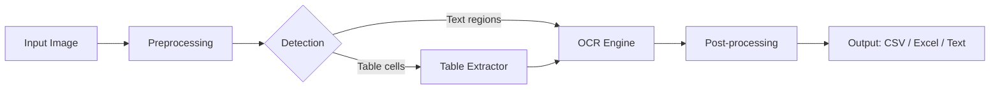

# OCR Pipeline — Simplified Text & Table Extraction

A beginner-friendly, modular OCR pipeline inspired by the IEEE paper *"Optical Character Recognition using YOLO4, Tesseract and PaddleOCR for Text Extraction"* (2025) — **without** training YOLO from scratch.

Uses **pretrained PaddleOCR** for detection + recognition and **Tesseract** as an optional fallback.

---

## 📁 Project Structure

```
OCR-YOLO/
├── main.py                    # CLI entry point
├── config.py                  # Shared configuration
├── pipeline.py                # Main orchestrator
├── preprocessing.py           # OpenCV image preprocessing
├── detection.py               # Text-region & table-cell detection
├── ocr_engine.py              # PaddleOCR + Tesseract OCR
├── table_extractor.py         # Table structure reconstruction
├── postprocessing.py          # Text cleaning & merging
├── output_handler.py          # CSV / Excel / text export
├── generate_sample_images.py  # Generate test images
├── requirements.txt           # Python dependencies
├── sample_images/             # Input images
└── output/                    # Generated results
```

---

## 🏗️ Architecture



---

## 🚀 Installation

### 1. Prerequisites

- **Python 3.8+**
- **Tesseract OCR** (optional fallback)

#### Install Tesseract (Windows)

1. Download from: https://github.com/UB-Mannheim/tesseract/wiki
2. Install and add to PATH (e.g., `C:\Program Files\Tesseract-OCR`)
3. For Hindi support, select the `hin` language pack during installation

#### Install Tesseract (Linux/macOS)

```bash
# Ubuntu / Debian
sudo apt install tesseract-ocr tesseract-ocr-hin

# macOS
brew install tesseract
```

### 2. Install Python Dependencies

```bash
cd OCR-YOLO
pip install -r requirements.txt
```

> **Note**: PaddleOCR downloads pretrained models (~150 MB) on first run.

---

## 💻 Usage

### Basic Usage

```bash
# Auto-detect mode (document or table)
python main.py --image sample_images/sample_document.png

# Explicit table mode
python main.py --image sample_images/sample_table.png --mode table

# Document mode with Hindi
python main.py --image my_hindi_doc.jpg --mode document --lang hi

# All output formats
python main.py --image photo.jpg --format csv excel text
```

### CLI Arguments

| Argument | Short | Default | Description |
|----------|-------|---------|-------------|
| `--image` | `-i` | *required* | Path to input image |
| `--mode` | `-m` | `auto` | `auto`, `document`, or `table` |
| `--lang` | `-l` | `en` | `en`, `hi`, `ch`, `fr`, `de` |
| `--output` | `-o` | `output/` | Output directory |
| `--format` | `-f` | `csv text` | `csv`, `excel`, `text` |

### Generate Sample Images

```bash
python generate_sample_images.py
```

This creates `sample_images/sample_document.png` and `sample_images/sample_table.png`.

---

## 🧪 Testing on New Images

1. Place your image in `sample_images/` (or use any path)
2. Run:
   ```bash
   python main.py --image path/to/your/image.png --mode auto
   ```
3. Check the `output/` folder for results

### Tips for Best Results

- Use **high-resolution** images (300+ DPI for scanned documents)
- Ensure **good contrast** between text and background
- For tables, ensure **visible grid lines** (the contour detection needs them)
- For **low-quality images**, the pipeline applies denoising automatically

---

## 📊 Datasets (for benchmarking / training)

| Dataset | Description | Link |
|---------|-------------|------|
| **ICDAR 2019** | Scene-text & document OCR benchmarks | [rrc.cvc.uab.es](https://rrc.cvc.uab.es/) |
| **PubLayNet** | Document layout analysis (350K+ images) | [GitHub](https://github.com/ibm-aur-nlp/PubLayNet) |
| **TableBank** | Table detection in documents (417K images) | [GitHub](https://github.com/doc-analysis/TableBank) |
| **TRDG** | Synthetic text image generator | [GitHub](https://github.com/Belval/TextRecognitionDataGenerator) |

---

## 🌐 Multilingual Support

| Language | `--lang` Code | PaddleOCR | Tesseract |
|----------|---------------|-----------|-----------|
| English | `en` | ✅ | ✅ |
| Hindi | `hi` | ✅ | ✅ (install `hin` pack) |
| Chinese | `ch` | ✅ | ✅ (install `chi_sim` pack) |
| French | `fr` | ✅ | ✅ (install `fra` pack) |
| German | `de` | ✅ | ✅ (install `deu` pack) |

---

## 🔧 Configuration

All tunable parameters are in [`config.py`](config.py):

- **Preprocessing**: resize width, threshold method, blur kernel size
- **Detection**: minimum contour area, cell dimensions
- **OCR**: confidence threshold for Tesseract fallback
- **Table extraction**: row grouping Y-tolerance
- **Output**: default format and output directory

---

## 📈 Improvements Over the IEEE Paper

| Aspect | Paper (YOLOv4) | This Pipeline |
|--------|----------------|---------------|
| Setup | Train YOLO from scratch | Pretrained PaddleOCR (zero training) |
| GPU required | Yes | No (CPU-friendly) |
| Complexity | High | Beginner-friendly |
| Table detection | YOLO bounding boxes | Contour-based (no training) |
| Fallback OCR | None | Tesseract as confidence-based fallback |
| Multilingual | Limited | 5+ languages via PaddleOCR |
| Output | Text only | CSV, Excel, and plain text |

---

## 📝 License

This project is for educational and research purposes.
