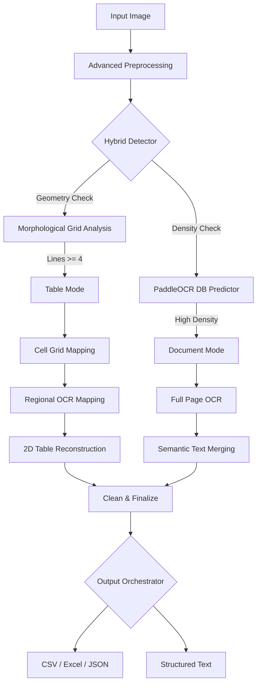

# 🚀 OCR-YOLO: Advanced Hybrid OCR Pipeline


[](https://www.python.org/downloads/)
[](https://github.com/PaddlePaddle/PaddleOCR)
[](https://github.com/tesseract-ocr/tesseract)
[](https://opencv.org/)

**OCR-YOLO** is a professional-grade, modular OCR pipeline designed for high-accuracy text extraction and complex table reconstruction. It implements a smart hybrid detection strategy that automatically switches between document analysis and structured table extraction.

---

## 📽️ System Architecture & Logic

The pipeline operates on a "Vision-First, Text-Second" principle. It uses computer vision to understand the **layout** before invoking heavy OCR models.



---

## ✨ Core Innovations

### 🧠 Intelligent Auto-Mode
Most OCR tools fail at tables because they treat them as paragraphs. OCR-YOLO analyzes the **Hough lines** and **contours** to detect if the data is structured. If it finds a grid, it switches to a specialized `TableExtractor`.

### 📊 Structural Integrity
Unlike standard wrappers, we reconstruct the actual 2D grid. If a cell is empty or merged, the `normalize_table` logic ensures the final CSV/Excel output maintains perfect alignment with the original document.

### 🛡️ Semantic Fallback System
We utilize **PaddleOCR** for its state-of-the-art accuracy. However, if the confidence score drops below a configurable threshold (e.g., 0.5), the system automatically triggers **Tesseract OCR** as a cross-verification layer.

---

## 🔍 Module-by-Module Deep Dive

### 📷 `preprocessing.py`
We don't just "read" the image. We refine it using:
- **Otsu's Binarization**: Automatically calculates the threshold for the best contrast.
- **Gaussian Blurring**: Removes "salt-and-pepper" noise from low-quality scans.
- **Adaptive Resizing**: Scales large images to an optimal width (default 1024px) for speed without losing OCR precision.

### 📐 `detection.py` & `table_extractor.py`
This identifies the "bones" of the document.
1. **Vertical/Horizontal Filtering**: Isolates structural lines.
2. **Contour Extraction**: Identifies rectangles.
3. **Y-Tolerance Grouping**: Because scanned tables are rarely perfectly straight, we use a proximity algorithm to group cells into logical rows.

---

## 🚀 Getting Started

### 1. Installation
Ensure you have Python 3.8+ and Tesseract installed on your system.

```bash
git clone https://github.com/Aksh8t/OCR-YOLO.git
cd OCR-YOLO
pip install -r requirements.txt
```

### 2. Usage Examples
**Auto-Detect (Recommended):**
```bash
python main.py --image invoice.png --mode auto
```

**Forced Table Extraction:**
```bash
python main.py --image budget_2024.jpg --mode table --format excel
```

**Hindi Document Processing:**
```bash
python main.py --image hindi_letter.png --lang hi --format text
```

---

## 💹 Comparison with Baseline

| Feature | Standard OCR | OCR-YOLO (Hybrid) |
| :--- | :--- | :--- |
| **Document Layout** | Ignores layout | Preserves structure |
| **Table Accuracy** | Scrambled text | Clean 2D Grid |
| **Multi-Engine** | Single engine | PaddleOCR + Tesseract Fallback |
| **Speed** | Constant | Variable (Fast mapping for tables) |

---

## 🛠️ Configuration Fine-Tuning
Tweak [`config.py`](config.py) to match your data:
- `MIN_CONTOUR_AREA`: Increase to ignore small icons/noise.
- `ROW_Y_TOLERANCE`: Increase if your scan is slightly tilted.
- `OCR_CONFIDENCE_THRESHOLD`: Set to 0.7 for stricter quality control.

---

## 🤝 Contributing & License
Contributions are welcome! Please open an issue first to discuss major changes.
Licensed under the **MIT License**.
