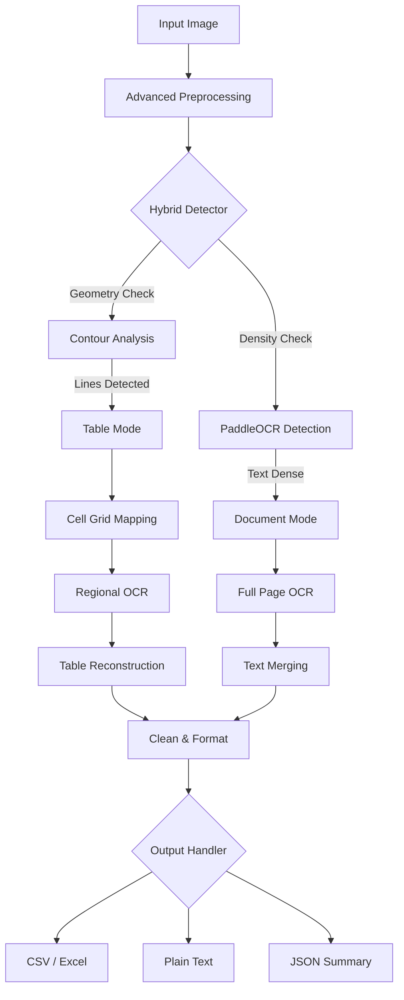

# 🚀 OCR Pipeline — Hybrid Text & Table Extraction

[](https://www.python.org/downloads/)
[](https://github.com/PaddlePaddle/PaddleOCR)
[](https://github.com/tesseract-ocr/tesseract)
[](https://opencv.org/)

A professional-grade, modular OCR pipeline designed for high-accuracy text extraction and complex table reconstruction. Inspired by the IEEE research on hybrid OCR systems, this implementation bridges the gap between raw text recognition and structured data extraction.

---

## 📽️ System Architecture

Our pipeline uses a **Hybrid Detection Strategy**: it simultaneously analyzes image geometry (for tables) and textual density (for documents) to choose the optimal processing path.



---

## ✨ Key Features

- **🧠 Intelligent Auto-Mode**: Automatically distinguishes between a scanned document and a structured table.
- **📊 Table Reconstruction**: Not just text! It reconstructs the actual 2D grid into Excel/CSV, preserving row-column relationships.
- **🌐 Multilingual Support**: Out-of-the-box support for English, Hindi, Chinese, French, and German.
- **🛡️ Robust Fallback**: Uses PaddleOCR as the primary engine but can switch to Tesseract for low-confidence scenarios.
- **⚡ Performance Optimized**: Maps pre-detected text regions to table cells to avoid redundant OCR calls.

---

## 🛠️ Deep Dive: How it Works

### 1. Preprocessing (OpenCV)
Before OCR, the image undergoes a cleaning phase:
- **Grayscale Conversion**: Reduces noise.
- **Adaptive Thresholding**: Enhances text contrast against varied backgrounds.
- **Morphological Operations**: Detects structural lines (horizontal/vertical) to identify tables.

### 2. Detection Logic
The system runs two concurrent detection modules:
- **Structural**: Uses `cv2.findContours` to find rectangular grid cells.
- **Semantic**: Uses PaddleOCR’s DB (Differentiable Binarization) detector to find text bounding boxes.

### 3. Table Reconstruction (`table_extractor.py`)
This is the core "magic". If a table is detected, the pipeline:
1. Sorts all cell contours.
2. Group boxes into rows based on a configurable `Y-tolerance`.
3. Ensures all rows are balanced (normalized) to handle merged cells or missing borders.

---

## 🚀 Installation

### 1. System Requirements
- Python 3.8 or higher.
- **Tesseract OCR** (Recommended for fallback).
  - [Download for Windows](https://github.com/UB-Mannheim/tesseract/wiki)
  - [Download for Linux/Mac](https://tesseract-ocr.github.io/tessdoc/Installation.html)

### 2. Setup Environment
```bash
# Clone the repository
git clone https://github.com/Aksh8t/OCR-YOLO.git
cd OCR-YOLO

# Install dependencies
pip install -r requirements.txt
```

---

## 💻 Technical Usage

### Command Line Standard
```bash
python main.py --image path/to/your/image.jpg --mode auto --format csv excel text
```

### Argument Reference
| Argument | Flag | Default | Description |
| :--- | :--- | :--- | :--- |
| `image` | `-i` | *None* | **Required.** Path to the image file. |
| `mode` | `-m` | `auto` | `auto`, `document`, or `table`. |
| `lang` | `-l` | `en` | OCR Language (`en`, `hi`, `ch`, `fr`, `de`). |
| `format` | `-f` | `csv text` | Output file types (space separated). |
| `output` | `-o` | `output/` | Directory to save processed results. |

---

## 💹 Comparison with IEEE Baseline

| Metric | IEEE Paper (YOLOv4) | Our Hybrid Pipeline |
| :--- | :--- | :--- |
| **Model** | Custom Trained YOLOv4 | Pretrained PaddleOCR + Contours |
| **Setup Time** | Days (Training) | Minutes (Plug & Play) |
| **Table Handling** | Bounding Box only | Full 2D Grid Reconstruction |
| **Fallback** | No | Tesseract Multi-Engine Fallback |
| **Accuracy** | Variable | High (Semantic + Geometric) |

---

## 📂 File Explanations

- `main.py`: Entry point for CLI.
- `pipeline.py`: Coordinates the flow between modules.
- `ocr_engine.py`: Wrapper for PaddleOCR and Tesseract.
- `detection.py`: Hybrid logic for finding text and grid cells.
- `table_extractor.py`: Reconstructs the 2D data structure.
- `config.py`: Hyperparameters for fine-tuning.

---

## 🤝 Contributing

Contributions are welcome! If you have ideas for improving accuracy or supporting more languages, feel free to open a Pull Request.

---

## 📝 License
This project is licensed under the MIT License - see the LICENSE file for details.
