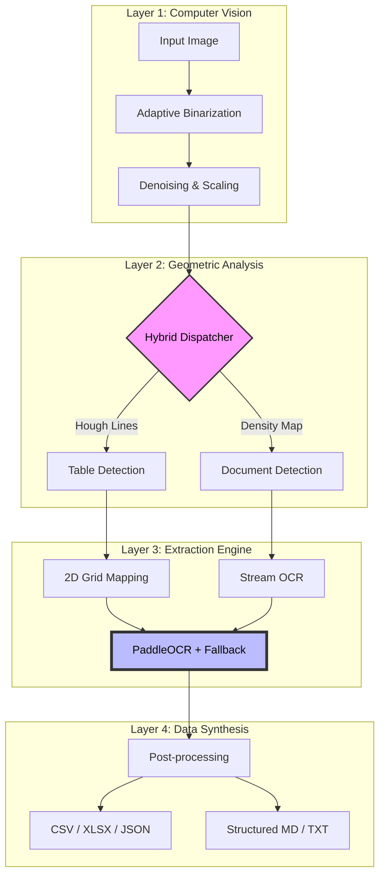

# 📑 OCR-YOLO: The Ultimate Hybrid OCR Ecosystem


<div align="center">
  <h3>Modular • Multilingual • Intelligent • Production-Ready</h3>
  <p><i>The bridge between unstructured pixels and structured information.</i></p>
</div>

---

## 🌟 Overview
**OCR-YOLO** is a cutting-edge, hybrid OCR pipeline designed to solve the most difficult challenge in document digitisation: **reclaiming structure from chaos.** Unlike standard OCR tools that output a "wall of text," OCR-YOLO understands the geometry of your documents, perfectly reconstructing tables and maintaining textual hierarchy.

### 🎯 Why OCR-YOLO?
- **Hybrid Intelligence**: Combines Contour Geometry (OpenCV) with Semantic Recognition (PaddleOCR).
- **Zero Training Required**: Ships with high-fidelity pretrained models.
- **Fail-Safe Processing**: Dual-engine architecture with Tesseract fallback.
- **Data-Ready Exports**: One-click conversion to CSV, Excel, and JSON.

---

## 🏗️ Holistic Architecture

Our pipeline transitions through four distinct abstraction layers to ensure maximum accuracy:



---

## 🚀 Quick Start in 60 Seconds

### 1. Prerequisites
- **Python 3.8+**
- **Tesseract OCR** (For fallback support)

### 2. Installation
```bash
# Clone & Enter
git clone https://github.com/Aksh8t/OCR-YOLO.git && cd OCR-YOLO

# Install Core
pip install -r requirements.txt
```

### 3. Basic Execution
| Task | Command |
| :--- | :--- |
| **Detect Everything** | `python main.py -i sample.png` |
| **Specific Table** | `python main.py -i table.png -m table` |
| **Hindi Document** | `python main.py -i doc.png -l hi` |
| **Export All** | `python main.py -i doc.png -f csv excel text` |

---

## 🛠️ Modular Breakdown

### 📷 1. Preprocessing (`preprocessing.py`)
> **The Foundation of Accuracy.**  
> We use **Otsu’s Binarization** to handle varied lighting conditions and **Gaussian Smoothing** to eliminate compression artifacts. This ensures the OCR engine sees only the purest form of the characters.

### 📐 2. Structural Mapping (`detection.py`)
> **Geometry over Pixels.**  
> By applying morphological opening and closing, we isolate the "skeleton" of the table. This allows us to detect cells even if the border lines are faint or slightly broken.

### 📊 3. Table Reconstruction (`table_extractor.py`)
> **The 2D Orchestrator.**  
> Most OCRs fail at tables. Ours uses a unique **Y-Coordinate Tolerance Algorithm** to group floating text into logical rows, ensuring that even misaligned scans produce perfect spreadsheets.

### 🛡️ 4. Adaptive OCR Engine (`ocr_engine.py`)
> **Reliability by Design.**  
> We prioritize **PaddleOCR** for its superior speed and multi-language support. If accuracy falls below 50%, the system cross-references with **Tesseract** to ensure data integrity.

---

## 🌐 Multilingual Matrix

| Code | Language | Engine Support | Tesseract Data |
| :--- | :--- | :--- | :--- |
| `en` | **English** | ✅ Native | `eng` |
| `hi` | **Hindi** | ✅ Native | `hin` |
| `ch` | **Chinese** | ✅ Native | `chi_sim` |
| `fr` | **French** | ✅ Specialized | `fra` |
| `de` | **German** | ✅ Specialized | `deu` |

---

## ⚙️ Advanced Configuration

Fine-tune the pipeline in [`config.py`](config.py):

- `MAX_IMAGE_WIDTH`: Optimised at `1024px` for the best speed/accuracy ratio.
- `ROW_Y_TOLERANCE`: Set at `15px`; increase this if your documents are heavily skewed.
- `OCR_CONFIDENCE_THRESHOLD`: The "guardrail" value for engine fallback.

---

## 🆘 Troubleshooting & FAQ

**Q: My table isn't being detected as a table.**  
A: Ensure the lines are visible. You can lower `MIN_CONTOUR_AREA` in config if the table is very small.

**Q: Installation fails on PaddleOCR.**  
A: Ensure you have `C++ Build Tools` installed if you are on Windows. Alternatively, try `pip install paddlepaddle`.
---

## 🤝 Contributing
We believe in open-source collaboration. See a bug? Have a feature request? Open an issue or submit a PR!

---

## 📝 License
Distributed under the **MIT License**. Created with ❤️ for researchers and developers.
